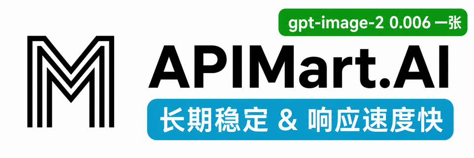

<p align="center">
  <a href="https://github.com/apconw/Aix-DB">
    
  </a>
</p>

<h3 align="center">Aix-DB - 大模型数据助手</h3>

<p align="center">
  基于大语言模型和RAG技术的智能数据分析系统，实现对话式数据分析（ChatBI），快速实现数据提取与可视化
</p>


<p align="center">
  <a href="https://github.com/apconw/Aix-DB/releases"></a>
  <a href="https://github.com/apconw/Aix-DB/stargazers"></a>
  <a href="https://github.com/apconw/Aix-DB/blob/master/LICENSE"></a>
  <a href="https://hub.docker.com/r/apcon/aix-db"></a>
</p>

<p align="center">
  <a href="./README.md">简体中文</a> | <a href="./README_en.md">English</a>
</p>

## 项目介绍

Aix-DB 基于 **LangChain/LangGraph** 框架，结合 **MCP Skills** 多智能体协作架构，实现自然语言到数据洞察的端到端转换。

**核心能力**：智能问答 · 数据问答（Text2SQL） · 表格问答 · 深度问数 · 数据可视化 · MCP 多智能体 · Skill 模式

**产品特点**：📦 开箱即用 · 🔒 安全可控 · 🔌 易于集成 · 🎯 越问越准 · 🧩 Skill 模式 · 🐾 OpenClaw 智能集成


## Aix-DB Pro 商业版

**让数据分析从一句提问开始，让业务洞察沉淀为报告与看板。**

Aix-DB Pro 面向企业业务分析场景，将自然语言问数、图表分析、报告中心与数据看板融于一体。从日常数据查询到经营指标追踪，用对话探索数据，让分析成果持续复用。

- **对话式数据分析**：用自然语言提问，结合明细表格与可视化图表查看结果、继续追问。
- **智能数据看板**：集中呈现核心指标、同比环比与趋势，通过对话补充和调整图表。
- **报告中心**：集中管理分析报告，支持预览、下载、分享与回溯原始对话。
- **丰富的可视化表达**：覆盖指标卡、趋势图、分布图、热力图等多种业务分析视角。

<table align="center">
  <tr>
    <td align="center" width="220">
      
    </td>
    <td valign="middle">
      <b>商务合作 &amp; 体验 POC，请添加我的微信</b><br /><br />
      微信号：<b>weber812</b><br />
      添加时请备注：<b>商务合作 / POC 体验</b><br /><br />
      欢迎交流企业数据分析需求、预约商业版演示，探讨业务场景验证与落地方案。
    </td>
  </tr>
</table>

### 商业版支持的数据库

<p align="center">
  
  
  
  
</p>
<p align="center">
  
  
  
  
</p>
<p align="center">
  
  
  
  
</p>
<p align="center">
  
  
  
  
</p>
<p align="center">
  
  
  
  
</p>
<p align="center">
  
  
  
  
</p>
<p align="center">
  
  
  
  
</p>
<p align="center">
  
  
</p>

### 商业版产品预览

<p align="center">
  <a href="./docs/docs/images/commercial/home.png"></a>
  <br /><sub>统一分析入口 · 从业务问题开启数据探索</sub>
</p>

<table>
  <tr>
    <td width="50%" align="center">
      <a href="./docs/docs/images/commercial/dashboard.png"></a><br />
      <b>数据看板</b><br /><sub>核心指标、同比环比与业务趋势一屏掌握</sub>
    </td>
    <td width="50%" align="center">
      <a href="./docs/docs/images/commercial/dashboard-chat.png"></a><br />
      <b>对话式看板编辑</b><br /><sub>边看边问，用自然语言完善分析视角</sub>
    </td>
  </tr>
  <tr>
    <td width="50%" align="center">
      <a href="./docs/docs/images/commercial/report-center.png"></a><br />
      <b>报告中心</b><br /><sub>沉淀分析成果，让报告可查阅、可分享</sub>
    </td>
    <td width="50%" align="center">
      <a href="./docs/docs/images/commercial/data-analysis.png"></a><br />
      <b>数据问答与图表分析</b><br /><sub>从明细到趋势，在对话中持续深入分析</sub>
    </td>
  </tr>
</table>

<details>
  <summary><b>展开查看完整看板长图 · 更多图表与分析场景</b></summary>
  <p align="center">
    <a href="./docs/docs/images/commercial/dashboard-gallery.jpg"></a>
  </p>
</details>

<p align="center"><sub>以上为商业版界面展示，点击图片可查看原图。</sub></p>

## 演示视频

<table align="center">
  <tr>
    <th>🎯 Skill 模式</th>
    <th>💬 标准模式</th>
  </tr>
  <tr>
    <td>
      <video src="https://github.com/user-attachments/assets/ee09d321-4534-4ccf-aa71-ecab83d91caf" controls="controls" muted="muted" style="max-height:320px; min-height: 150px;"></video>
    </td>
    <td>
      <video src="https://github.com/user-attachments/assets/462f4e2e-86e0-4d2a-8b78-5d6ca390c03c" controls="controls" muted="muted" style="max-height:320px; min-height: 150px;"></video>
    </td>
  </tr>
  <tr>
    <th>🧩 Skill 技能中心</th>
    <th>🐾 OpenClaw 模式</th>
  </tr>
  <tr>
    <td>
      <video src="https://github.com/user-attachments/assets/c3f76eba-a710-4936-b0f9-c658a035826d" controls="controls" muted="muted" style="max-height:320px; min-height: 150px;"></video>
    </td>
    <td>
      <video src="https://github.com/user-attachments/assets/98417cb2-e829-4733-999f-7f1494424707" controls="controls" muted="muted" style="max-height:320px; min-height: 150px;"></video>
    </td>
  </tr>
</table>


💰 赞助商展示
---

| Doloffer                                                                                                                      | IP数据云                                                                                                                                                  |
|-------------------------------------------------------------------------------------------------------------------------------|-----------------------------------------------------------------------------------------------------------------------------------------------------------|
| <a href="https://doloffer.com/" target="_blank"></a> | <a href="https://app.ipdatacloud.com/check_login/set_cookie_ip66?target_url=https://www.ipdatacloud.com/?utm-source=SQ&utm-keyword=?4897&name=spread_id&value=4897" target="_blank"></a> |

<table>
  <tr>
    <td width="180" align="center">
      <a href="https://go.apimart.ai/gh-aix-db" target="_blank">
        
      </a>
    </td>
    <td>
      感谢 APIMart 赞助了本项目！APIMart 是专注 AI 图片/视频生成的低价 API 平台，GPT-Image-2 低至 $0.006/张，1 美元可出图 160+ 张。图片、视频一套异步 API 通吃，提交任务拿 ID、回调取结果，跑批万张不超时、换模型不改代码。按量付费、无月费，通过此<a href="https://go.apimart.ai/gh-aix-db" target="_blank">注册链接</a>注册即可开用。
    </td>
  </tr>
</table>


## 系统架构

<p align="center">
  
</p>

**分层架构设计：**

- **前端层**：Vue 3 + TypeScript 构建的现代化 Web 界面，集成 ECharts 和 AntV 可视化组件
- **API 网关层**：基于 Sanic 的高性能异步 API 服务，提供 RESTful 接口和 JWT 认证
- **智能服务层**：LLM 服务、Text2SQL Agent、RAG 检索引擎、MCP 多智能体协作
- **数据存储层**：支持多种数据库类型，包括关系型数据库、向量数据库、图数据库和文件存储


## 支持的数据源

<p align="center">
  
  
  
  
</p>
<p align="center">
  
  
  
  
</p>
<p align="center">
  
  
  
</p>


<p align="center">
  
</p>

| 步骤  | 模块             | 说明                                                               |
| :---: | ---------------- | ------------------------------------------------------------------ |
|   1   | **用户输入**     | 用户以自然语言提出数据查询问题                                     |
|   2   | **LLM 意图理解** | 大模型解析问题意图，抽取关键实体和查询条件                         |
|   3   | **RAG 知识检索** | Embedding + BM25 混合检索，结合 Neo4j 图谱获取相关表结构和业务知识 |
|   4   | **SQL 生成**     | Text2SQL 引擎生成 SQL 语句，并进行语法校验和优化                   |
|   5   | **数据库执行**   | 在目标数据源执行 SQL，支持 8+ 种数据库类型                         |
|   6   | **可视化展示**   | 自动生成 ECharts/AntV 图表，直观呈现分析结果                       |


## 快速开始

### 使用 Docker 部署（推荐）
```bash
docker run -d \
  --name aix-db \
  --restart unless-stopped \
  -e TZ=Asia/Shanghai \
  -e JWT_SECRET_KEY=<your-generated-secret> \
  -e SERVER_HOST=0.0.0.0 \
  -e SERVER_PORT=8088 \
  -e SERVER_WORKERS=2 \
  -e LANGFUSE_TRACING_ENABLED=false \
  -e LANGFUSE_SECRET_KEY= \
  -e LANGFUSE_PUBLIC_KEY= \
  -e LANGFUSE_BASE_URL= \
  -e VITE_ENABLE_PAGE_AGENT=false \
  -e LLM_MAX_TOKENS=65536 \
  -p 18080:80 \
  -p 18088:8088 \
  -p 15432:5432 \
  -p 9000:9000 \
  -p 9001:9001 \
  -v ./volume/pg_data:/var/lib/postgresql/data \
  -v ./volume/minio/data:/data \
  -v ./volume/logs/supervisor:/var/log/supervisor \
  -v ./volume/logs/nginx:/var/log/nginx \
  -v ./volume/logs/aix-db:/var/log/aix-db \
  -v ./volume/logs/minio:/var/log/minio \
  -v ./volume/logs/postgresql:/var/log/postgresql \
  --add-host host.docker.internal:host-gateway \
  crpi-7xkxsdc0iki61l0q.cn-hangzhou.personal.cr.aliyuncs.com/apconw/aix-db:1.2.4
```

### 使用 Docker Compose

```bash
git clone https://github.com/apconw/Aix-DB.git
cd Aix-DB/docker
cp .env.template .env  # 复制环境变量模板，按需修改（推荐开启 VITE_ENABLE_PAGE_AGENT=true）
```

编辑 `docker/.env`，设置必填的 `JWT_SECRET_KEY`（留空会导致 `docker-compose up` 直接报错）：
```bash
# 生成一个随机密钥
python3 -c "import secrets; print(secrets.token_hex(32))"
```
> **注意**：所有 worker/副本必须使用相同的 `JWT_SECRET_KEY`；更换密钥会使已签发的登录 token 全部失效，所有用户需重新登录。

```bash
docker-compose up -d
```

### 访问系统

**Web 管理界面**
- 访问地址：http://localhost:18080
- 默认账号：`admin`
- 默认密码：`123456`

**PostgreSQL 数据库**
- 连接地址：`localhost:15432`
- 数据库名：`aix_db`
- 用户名：`aix_db`
- 密码：`1`

### 本地开发

**① 克隆项目**
```bash
git clone https://github.com/apconw/Aix-DB.git
cd Aix-DB
```

**② 启动依赖中间件**（PostgreSQL、MinIO 等）

容器内也会启动一份后端服务，同样需要 `JWT_SECRET_KEY`，请先按上面「使用 Docker Compose」一节配置好 `docker/.env` 再执行：
```bash
cd docker
docker-compose up -d
```

**③ 配置环境变量**

编辑项目根目录下的 `.env.dev`，按需修改数据库连接、MinIO 地址等配置（默认配置可直接使用）

**④ 安装 Python 依赖**（需要 Python 3.11）
```bash
# 方式一：pip
pip install -r requirements.txt

# 方式二：uv（推荐，更快）
uv venv --python 3.11
source .venv/bin/activate
uv sync
```

**⑤ 启动后端服务**
```bash
# Windows PowerShell 专属命令：设置环境变量+运行脚本，一行执行  增加字符兼容性，解决有些机器错误问题。
$env:PYTHONUTF8=1; python serv.py
```

**⑥ 启动前端开发服务器**（另开终端）
```bash
cd web
npm install
npm run dev
```


## 命令行工具（CLI）

[](https://www.npmjs.com/package/@apconw/aix-db-cli)

通过终端直接发起自然语言数据查询，支持图表渲染输出。

```bash
# 安装
npm install -g @apconw/aix-db-cli

# 登录（浏览器完成认证，token 有效期 7 天）
aix-db-cli login

# 查看可用数据源
aix-db-cli datasources

# 数据问答
aix-db-cli chat "有哪些数据表？" --datasource 48
aix-db-cli chat "查询销售额趋势" --datasource 48 --stream
```

详细文档见 [aix-db-cli/README.md](./aix-db-cli/README.md)。

## 技术栈

**后端**：Sanic · SQLAlchemy · LangChain/LangGraph · Neo4j · FAISS/Chroma · MinIO

**前端**：Vue 3 · TypeScript · Vite 5 · Naive UI · ECharts · AntV

**AI 模型**：OpenAI · Anthropic · DeepSeek · Qwen · Ollama

🤝 成为赞助者
---

成为赞助者，可以将您的产品展示在这里，每天获得大量曝光！

<sub>联系方式：微信 <b>weber812</b>（备注：赞助合作）</sub>

## 贡献指南

欢迎提交 Issue 和 Pull Request！

1. Fork 本仓库
2. 创建特性分支 (`git checkout -b feature/AmazingFeature`)
3. 提交更改 (`git commit -m 'Add some AmazingFeature'`)
4. 推送到分支 (`git push origin feature/AmazingFeature`)
5. 提交 Pull Request

## Star History

[](https://star-history.com/#apconw/Aix-DB&Date)


## 开源许可

本项目采用 [Apache License 2.0](./LICENSE) 开源许可证。
