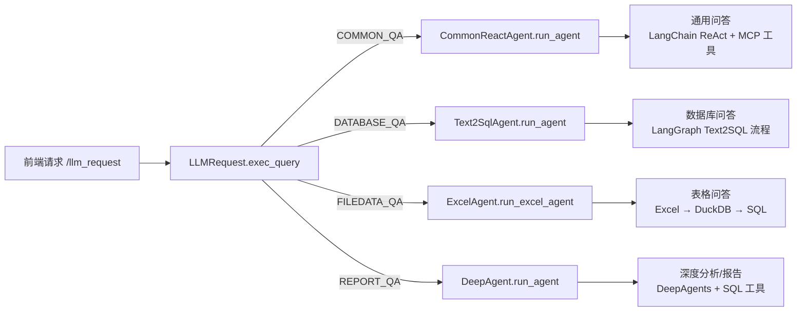
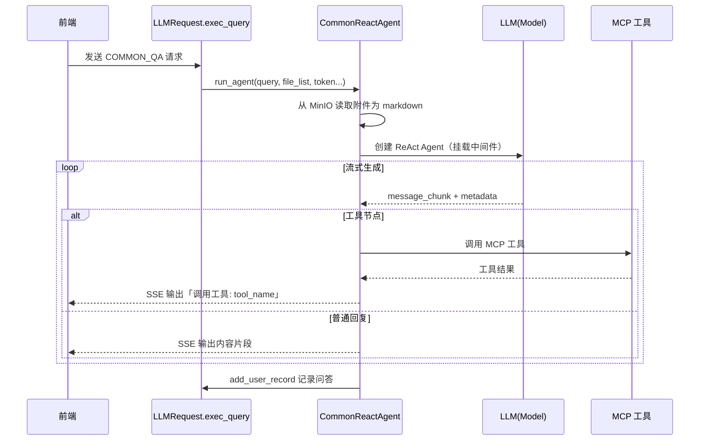

## 项目智能体与执行流程说明

本文档介绍项目中各类智能体（Agent）的职责、调用入口、执行流程及依赖的关键工具组件，并通过 Mermaid 流程图展示整体链路，方便快速理解与排查问题。

- **统一入口**：`services/llm_service.py` 中的 `LLMRequest.exec_query`
- **问答类型路由**（根据 `qa_type`）：
  - `COMMON_QA` → `CommonReactAgent`（通用问答）
  - `DATABASE_QA` → `Text2SqlAgent`（数据库 Text-to-SQL 问答）
  - `FILEDATA_QA` → `ExcelAgent`（表格文件问答）
  - `REPORT_QA` → `DeepAgent`（深度分析 / 报告型 Text-to-SQL）

---

## 顶层架构与路由

**入口文件**：`services/llm_service.py`

- 对外统一 HTTP 接口由 `LLMRequest.exec_query` 接收请求。
- 解析请求体中的 `qa_type`，将请求分发到不同 Agent。
- Agent 全部采用 **SSE 流式输出**，中间过程与最终结果都会实时推送到前端。



---

## CommonReactAgent（通用问答）

- **核心文件**：`agent/common_react_agent.py`
- **入口方法**：`CommonReactAgent.run_agent(query, response, session_id, uuid_str, user_token, file_list)`

### 职责

- 处理不依赖特定数据库 / 文件结构的通用自然语言问答。
- 可选从 MinIO 读取附件内容，将其转换为 markdown 追加到用户问题后，作为上下文。
- 基于 LangChain ReAct Agent + MCP 工具完成复杂任务。
- 支持多轮对话记忆与上下文压缩。

### 关键依赖

- **LLM 与 Agent 构建**
  - `common.llm_util.get_llm()`：统一的大模型创建封装。
  - `langchain.agents.create_agent`：创建 ReAct Agent。
  - `langgraph.checkpoint.memory.InMemorySaver`：多轮对话记忆。
- **工具与上下文**
  - `langchain_mcp_adapters.MultiServerMCPClient`：管理 MCP 工具（`MCP_HUB_COMMON_QA_GROUP_URL`）。
  - `common.minio_util.MinioUtils`：从 MinIO 读取附件内容。
- **中间件**
  - `agent.middleware.customer_middleware.log_before_model`：请求前日志。
  - `SummarizationMiddleware`：对长上下文进行总结压缩。
  - `ContextEditingMiddleware` + `ClearToolUsesEdit`：清理历史工具调用，控制上下文长度。

### 执行流程（时序图）



---

## Text2SqlAgent（数据库问答 / Text-to-SQL）

- **核心文件**：
  - `agent/text2sql/text2_sql_agent.py`
  - `agent/text2sql/analysis/graph.py`
  - `agent/text2sql/state/agent_state.py`
  - `agent/text2sql/database/db_service.py`
- **入口方法**：`Text2SqlAgent.run_agent(query, response, chat_id, uuid_str, user_token, datasource_id)`

### 职责

- 将自然语言问题转换为 SQL，在指定数据源上执行。
- 做数据源权限校验、行/列级权限注入。
- 生成图表配置、渲染数据和推荐问题。
- 通过 SSE 流式输出执行进度（步骤开始/结束）与关键结果。

### LangGraph 状态与节点

- **状态类型**：`AgentState`（`agent/text2sql/state/agent_state.py`）
  - 核心字段：`user_query`、`db_info`、`generated_sql`、`execution_result`、`report_summary`、`datasource_id`、`user_id`、`filtered_sql`、`recommended_questions` 等。
- **主要节点**（`create_graph`）：
  - `datasource_selector` → 自动选择/校验数据源。
  - `error_handler` → 数据源错误统一处理。
  - `schema_inspector` → `DatabaseService.get_table_schema`，检索表结构。
  - `early_recommender` → 提前启动推荐问题生成。
  - `sql_generator` → `sql_generate`，生成 SQL。
  - `permission_filter` → `permission_filter_injector`，注入权限规则。
  - `sql_executor` → `DatabaseService.execute_sql`。
  - `parallel_collector` → `parallel_collect_after_sql_executor`，并行处理图表 & 总结。
  - `unified_collector` → `unified_collect`，统一推送总结 + 图表数据 + 推荐问题。

### 执行流程（流程图）

```mermaid
flowchart TD
    A[Text2SqlAgent.run_agent] --> B[decode_jwt_token<br/>获取 user_id / task_id]
    B --> C[构造 AgentState<br/>user_query/datasource_id/user_id]
    C --> D{有 datasource_id?}
    D -->|是| E[DB 会话中检查 DatasourceAuth<br/>是否授权]
    E -->|无权限| F[写入 error_message<br/>清空 datasource_id]
    D -->|否| G[跳过权限检查]

    F --> H[create_graph(datasource_id)<br/>构建 LangGraph]
    G --> H
    H --> I[graph.astream(...,<br/>stream_mode=updates)]

    I --> J[_process_chunk]
    J --> K[_handle_step_change<br/>发送 STEP_PROGRESS]
    J --> L[_process_step_content]

    L -->|schema_inspector| M[格式化 DB schema + BM25 关键词]
    L -->|sql_generator| N[生成 SQL 文本]
    L -->|permission_filter| O[注入权限后的 filtered_sql]
    L -->|sql_executor| P[执行 SQL，得到 ExecutionResult]
    L -->|unified_collector| Q[推送<br/>summarize → render_data → recommended_questions]

    Q --> R[add_user_record<br/>保存问答 + 业务数据 + SQL]
    R --> S[SSE 发送 record_id 给前端]
```

---

## ExcelAgent（表格文件问答）

- **核心文件**：
  - `agent/excel/excel_agent.py`
  - `agent/excel/excel_graph.py`
  - `agent/excel/excel_agent_state.py`
  - `agent/excel/excel_duckdb_manager.py`
- **入口方法**：`ExcelAgent.run_excel_agent(query, response, chat_id, uuid_str, user_token, file_list)`

### 职责

- 将用户上传的 Excel / CSV 等表格文件映射成 DuckDB 表。
- 基于自然语言自动生成 SQL 并在 DuckDB 上执行。
- 生成表格/图表渲染数据 + 推荐问题。
- 支持「上传一次，多轮对话」的使用体验。

### LangGraph 状态与节点

- **状态类型**：`ExcelAgentState`（`agent/excel/excel_agent_state.py`）
  - 核心字段：`user_query`、`file_list`、`file_metadata`、`sheet_metadata`、`db_info`、`generated_sql`、`chart_type`、`execution_result`、`report_summary`、`render_data`、`recommended_questions` 等。
- **主要节点**（`create_excel_graph`）：
  - `excel_parsing` → `read_excel_columns`，解析文件与 Sheet 结构，注册到 DuckDB。
  - `early_recommender` → `start_early_recommender`，提前生成推荐问题。
  - `sql_generator` → `sql_generate_excel`，生成 SQL。
  - `sql_executor` → `exe_sql_excel_query`，在 DuckDB 中执行。
  - `parallel_collector` → `parallel_collect_after_sql_executor`。
  - `unified_collector` → `unified_collect`，统一推送总结 + 图表 + 推荐问题。
  - 兼容节点：`chart_generator`、`summarize`、`data_render`、`data_render_apache`、`question_recommender`。

### 执行流程（流程图）

```mermaid
flowchart TD
    A[ExcelAgent.run_excel_agent] --> B{file_list 是否为空?}
    B -->|是| C[从历史记录 query_user_qa_record<br/>中恢复上一次 file_list]
    B -->|否| D[使用当前请求中的 file_list]
    C --> E[构造 ExcelAgentState]
    D --> E

    E --> F[create_excel_graph()<br/>构建 LangGraph]
    F --> G[decode_jwt_token 获取 task_id<br/>写入 running_tasks]
    G --> H[graph.astream(...,<br/>stream_mode=updates)]

    H --> I[_process_chunk]
    I --> J[_handle_step_change<br/>STEP_PROGRESS]
    I --> K[_process_step_content]

    K -->|excel_parsing| L[解析文件/Sheet 元数据<br/>注册 DuckDB 表]
    K -->|sql_generator| M[生成 SQL + sql_response_json]
    K -->|sql_executor| N[执行 SQL（DuckDB）]
    K -->|data_render / data_render_apache| O[生成表格/图表渲染数据]
    K -->|unified_collector| P[统一推送<br/>summarize → render_data → recommended_questions]

    P --> Q[add_user_record<br/>保存 summarize + 图表数据 + SQL]
    Q --> R[SSE 发送 record_id]
```

---

## DeepAgent（深度 Text-to-SQL / 报告 Agent）

- **核心文件**：
  - `agent/deepagent/deep_research_agent.py`
  - `agent/deepagent/AGENTS.md`
  - `agent/deepagent/tools/native_sql_tools.py`
  - `agent/deepagent/tools/tool_call_manager.py`
- **入口方法**：`DeepAgent.run_agent(query, response, session_id, uuid_str, user_token, file_list, datasource_id)`

### 职责

- 基于 DeepAgents 框架完成多阶段 Text-to-SQL 任务：
  - 思考与规划 → 工具调用（SQL 工具）→ 回答 / 报告。
- 严格遵守 `AGENTS.md` 中定义的执行流程与安全规则（只读 SQL、限制重试次数、避免循环调用）。
- 支持技能（skills）驱动的子代理，如：
  - `schema-exploration`：架构探索。
  - `query-writing`：复杂 SQL 构造。
  - `report-generation`：HTML 报告生成。

### SQL 工具与调用管理

- **SQL 工具来源**：
  - 若数据源走 SQLAlchemy：
    - 使用 `SQLDatabaseToolkit` 自动提供 `sql_db_query` 等工具。
  - 若数据源走原生驱动：
    - 使用 `native_sql_tools.py` 中定义的工具：
      - `sql_db_list_tables`
      - `sql_db_schema`
      - `sql_db_query`
      - `sql_db_query_checker`
      - `sql_db_table_relationship`
- **工具调用管理器**：`tool_call_manager`
  - 会话级统计工具调用情况。
  - 防止重复执行相同 SQL、多次获取相同表结构等。
  - 超出限制时会触发终止，返回友好提示。

### 执行流程（流程图）

```mermaid
flowchart TD
    A[DeepAgent.run_agent] --> B{是否提供 datasource_id?}
    B -->|否| C[通过 SSE 返回错误提示<br/>直接结束]
    B -->|是| D[decode_jwt_token 获取 task_id]
    D --> E[构造 effective_session_id<br/>并 reset tool_manager 会话状态]

    E --> F[_create_sql_deep_agent(datasource_id, session_id)]
    F --> G{连接方式}
    G -->|SQLAlchemy| H[使用 SQLDatabaseToolkit<br/>构建 SQL 工具]
    G -->|原生驱动| I[set_native_datasource_info<br/>使用 native_sql_tools]
    H --> J[create_deep_agent<br/>加载 AGENTS.md + skills/ 目录]
    I --> J

    J --> K[_stream_response<br/>agent.astream(...,<br/>messages + updates)]

    K --> L[messages 流：思考/回答 token]
    L --> M[PhaseTracker<br/>管理阶段 PLANNING/EXECUTION/SUB_AGENT/REPORTING]
    M --> N[通过 <details> 包裹<br/>思考区与子代理区<br/>REPORT_HTML 直接透传]

    K --> O[updates 流：工具调用/结果]
    O --> P[_process_update_message<br/>格式化工具调用与结果]
    P --> Q[tool_call_manager 记录调用统计]

    K --> R[answer_collector 收集全部输出]
    R --> S[add_user_record<br/>保存 REPORT_QA 记录]
    S --> T[SSE 发送 STREAM_END]
```

### 执行规范（摘自 AGENTS.md 关键点）

- **三步流程（必须遵守）**：
  1. 思考与规划：先输出需求理解与执行计划。
  2. 严格按计划执行：避免重复工具调用与重复 SQL。
  3. 总结与回答：清晰说明结论，可选生成 HTML 报告。
- **安全规则**：
  - 只允许 `SELECT` 查询，禁止 `INSERT/UPDATE/DELETE/DROP/ALTER/TRUNCATE/CREATE` 等写操作。
  - 避免无限重试，同一 SQL 最多重试有限次数。
  - 有数据源关系图时，应优先使用 `sql_db_table_relationship` 辅助构造 JOIN。

---

## 调试与扩展建议

- **快速定位链路问题**：
  - 优先查看 `services/llm_service.py`，确认 `qa_type` 路由是否正确。
  - 对于 Text2SQL / Excel / DeepAgent，可以通过日志中的 **步骤进度** 或 **工具调用记录** 定位是哪个节点出错。
- **新增 Agent 的建议路径**：
  1. 在 `services/llm_service.py` 中增加新的 `qa_type` 分支。
  2. 为新 Agent 设计明确的 **状态结构**、**LangGraph 节点** 或 **工具集**。
  3. 保持与现有 Agent 相同的 SSE 输出协议（`DataTypeEnum` + `messageType`），以便前端复用现有 UI 组件。

